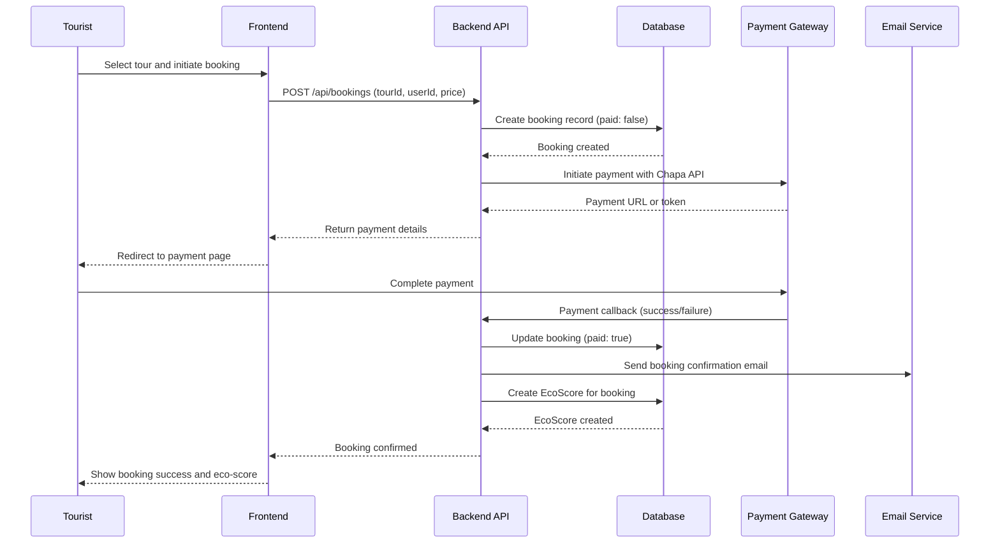
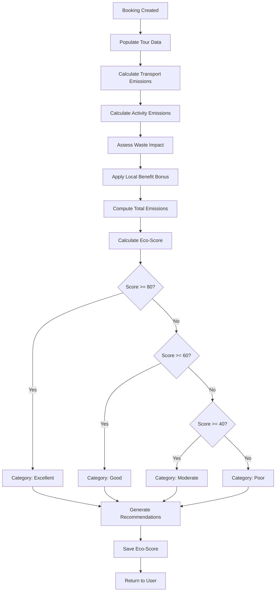

# UML Diagrams for Hulet Fish Platform


## Sequence Diagram for Booking Process



## Use Case Diagram

```mermaid
graph TD
    A[Tourist] --> B[Register Account]
    A --> C[Login]
    A --> D[Browse Tours]
    A --> E[Book Tour]
    A --> F[View Eco-Score]
    A --> G[Purchase Carbon Offset]
    A --> H[Leave Review]

    I[Host] --> J[Register as Host]
    I --> K[Login]
    I --> L[Create Tour Listing]
    I --> M[Manage Bookings]
    I --> N[View Earnings]
    I --> O[Update Profile]

    P[Admin] --> Q[Login]
    P --> R[Manage Users]
    P --> S[Manage Tours]
    P --> T[View Analytics]
    P --> U[Manage Carbon Offsets]
    P --> V[Manage Emission Factors]
```



## Activity Diagram for Eco-Score Calculation



## Entity-Relationship Diagram (ERD)

```mermaid
erDiagram
    User ||--o{ Booking : makes
    User ||--o{ EcoScore : has
    Tour ||--o{ Booking : booked_for
    Booking ||--|| EcoScore : generates
    Booking ||--o{ CarbonOffset : offsets_via
    EmissionFactor ||--o{ EcoScore : used_for

    User {
        string name
        string email
        string role
        string region
        string gender
        boolean isVerified
    }

    Tour {
        string name
        number duration
        number price
        string difficulty
        object emissionData
    }

    Booking {
        objectId tour
        objectId user
        number price
        boolean paid
        object ecoData
    }

    EcoScore {
        objectId user
        objectId trip
        number ecoScore
        string category
        number transportEmissions
        number activityEmissions
    }

    CarbonOffset {
        string name
        string type
        number costPerKg
        string location
        boolean active
    }

    EmissionFactor {
        string transportType
        number emissionFactor
        string unit
        boolean active
    }
